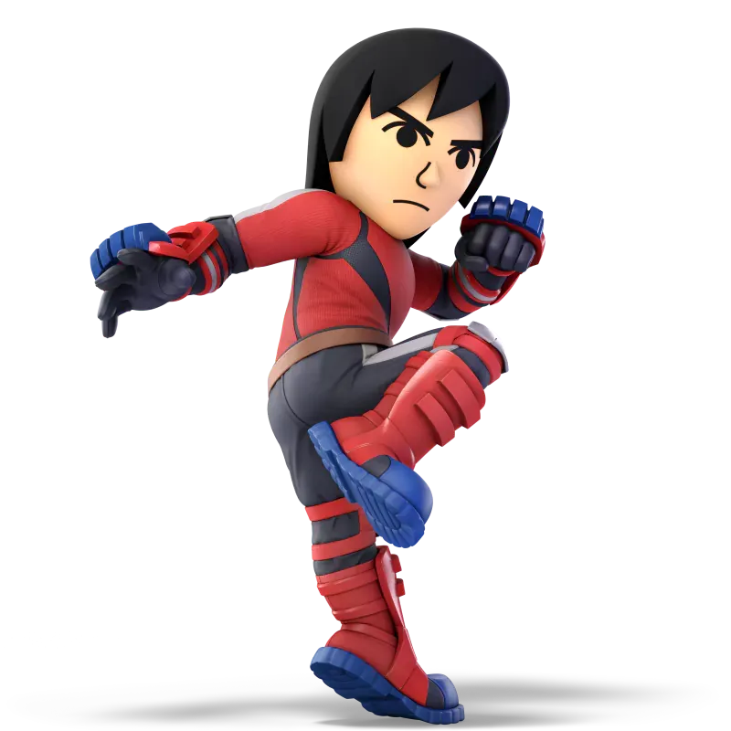

# Mii Brawler Tips & Tricks
## Overview

1. Brawler is a rushdown character. Strike fast, hard, and K.O. faster than you lose your own stocks.
2. Even though Brawler has some crazy combos, don't forget to control neutral and win those little fights. Every amount of % counts. 
3. Always go for a stage with platforms. That could be PS2, Small Battlefield or even basic Battlefield. Just make sure you've got on-stage platforms to work with.

---

---
## Neutral
1. Firstly, Mii Brawler has a slower neutral than one would expect. A character aptly called "brawler" would be assumed to be fast get-in-and-out now playstyle. While this holds true for combos, his neutral is much more methodical.
2. A good majority of neutral for Brawler consists of shot-put, then punish. Make them shield, get a grab in, or start any number of Brawler combos from a shot-put punish.
3. Remember to reset neutral. Combos are cool, living longer is cooler. Unless you have a guaranteed finisher, don't overextend combos.

---
## Combos
1. Down throw is the best combo starter for early %, hands down. Chain it with N-air into other attacks for large damage before a neutral reset you can be happy about.
2. D-tilt and U-tilt are both pleasant combo starters at early %, but the D-tilt stops being a combo piece and becomes either a disruption to your plan OR a kill move at extremely high %.
3. N-air is the best disruption, combo piece, neutral poke, everything. Throw this out any time you need a break from the opponent's game plan.

---
## K.O. Moves
1. Thrust Uppercut, commonly referred to affectionately as "Thrupper", is my favorite Brawler recovery and kill move. Just remember when chained with down throw, a SINGLE jump is enough to throw a thrupper out. It's a combo ender, and a stock ender. Use it as needed.
2. B-air. High % kill move, effective at stealing stocks with lethal speed in late-game and achieving max swag. Otherwise, do not use this move.
3. U-smash. Good early combo finisher, good punish tool, good kill move. Comes out fast, has a fairly large hitbox, and it's kind of a backflip. Awesome.
4. D-air. A clunky spike that feels like heaven to connect. Use only for stylish plays.
5. F-smash. Good punish, but I suck with it. A truly fun move that kills, ledge punishes, and overall is just fun.

